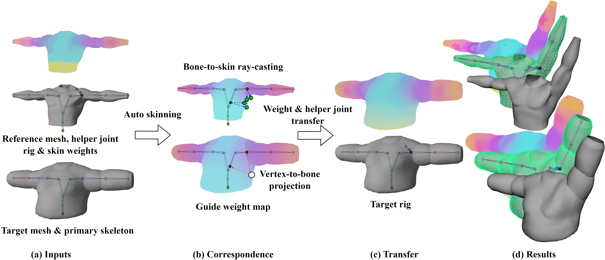
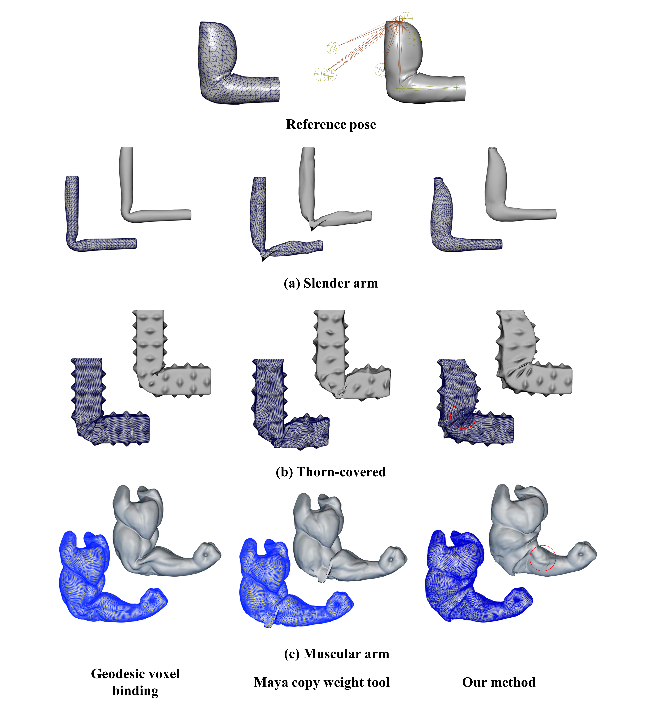
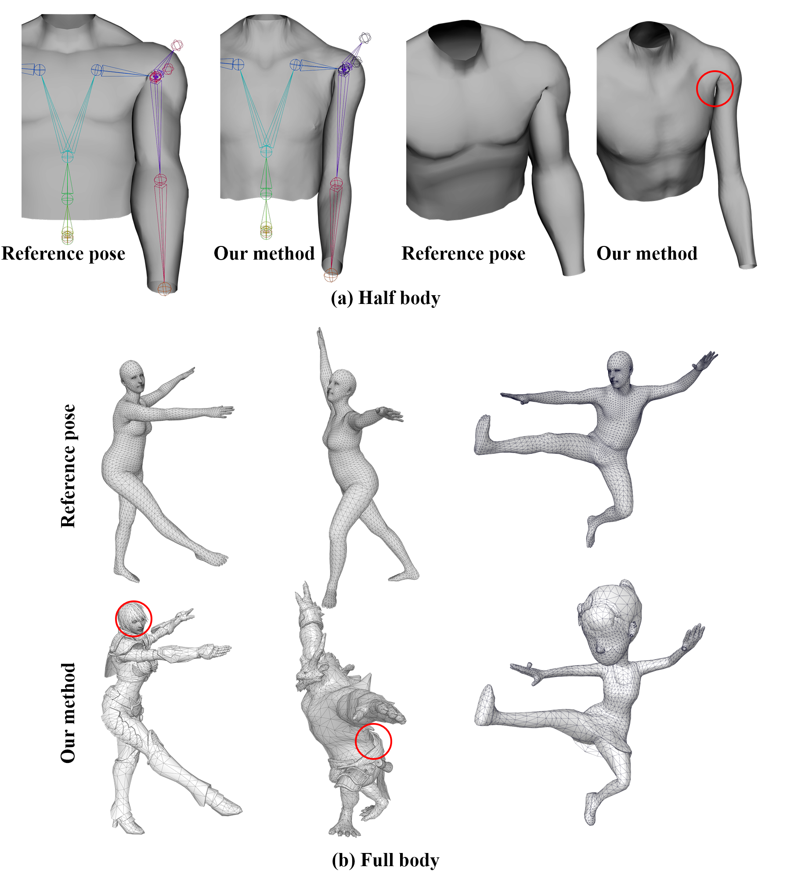

# Skeleton-Aware Skin Weight Transfer for Helper Joint Rigs

> **Authors**: [Ziyuan Cao](https://github.com/Ziyuan-Cao), [Tomohiko Mukai](https://github.com/TomohikoMukai)
>
> **Affiliations**: Tokyo Metropolitan University, Silicon Studio

[[Video]](https://www.youtube.com/watch?v=LyW50RFzJOs&feature=youtu.be)

**Abstract**

We propose a method to transfer skin weights and helper joints from a reference model to other targets. Our approach uses two types of spatial proximity to find the correspondence between the target vertex and reference mesh regions. The proposed method first generates a guide weight map to establish a relationship between the skin vertices and skeletal joints using a standard skinning technique. The correspondence between the reference and target skins is established using vertex-to-bone projection and bone-to-skin ray-casting using the guide weights. This method enables fully automated and smooth transfer of skin weight between human-like characters bound to helper joint rigs.

<div align="center">

</div>

## Updates
- 2024.03: Updated code

## Requirement
- Maya2020.4 
- Maya devkitBase2020.4

## Installation
1.Set Additional Include Directories
```
[your Maya devkitBase2020.4 location]\devkitBase\include
```
2.Set Additional Library Directories
```
[your Maya devkitBase2020.4 location]\devkitBase\lib
```
3.Add Additional Dependencies
```
Foundation.lib
OpenMaya.lib
OpenMayaAnim.lib
```
[Learn more about how to create a maya plugin with Visual studio](https://mukai-lab.org/library/maya-cpp-plugin/)

[Maya Documentation](https://help.autodesk.com/view/MAYAUL/2024/ENU/?guid=Maya_SDK_A_First_Plugin_cpp_html)

## Run
1.Load plugin
```
1.move built .mll to plugin directory [your Maya devkitBase2020.4 plug-ins location]
2.open your maya project and load .mll 
```
2.Prepare three sets of models
```
1.a reference model with main joints
2.a reference model with main joints and helper joints
3.a target model with main joints
*Note that the joint names of the three sets of models must be the same, and use different namespaces to distinguish them.*
```
3.Transfer
```
1.Select meshes in order prompted above
2.Select root joints in order prompted above
3.run command "De [sample numbers] [cone angle] [alpha] [if debug 1 or 0]"
Ex: De 128 30 3 1
```

## Result
<div align="center">

</div>
<div align="center">

</div>